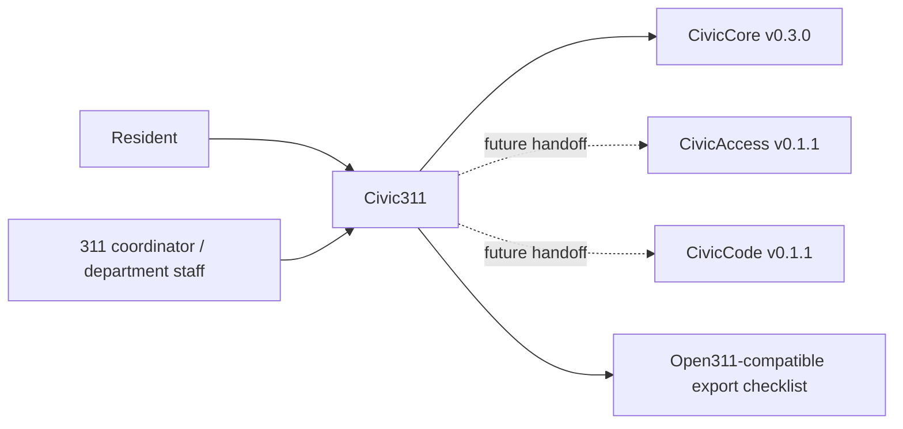

# Civic311 User Manual

## For Non-Technical Users

Civic311 helps city staff organize resident service requests before they become official work orders. It can create a sample intake stub, suggest a triage bucket, surface duplicate candidates, prepare routing steps, and assemble an Open311-compatible export checklist.

Current state: `0.1.1` resident service request foundation release, aligned to `civiccore==0.3.0`. Civic311 does not dispatch crews, create official work orders, handle emergencies, provide legal advice, call live LLMs, write back to 311/work-order systems, or update a 311 system of record. Staff own every decision.

## For IT and Technical Staff

Civic311 is a FastAPI Python package pinned to `civiccore==0.3.0`. The current runtime exposes:

- `GET /`
- `GET /health`
- `GET /civic311`
- `POST /api/v1/civic311/intake`
- `POST /api/v1/civic311/triage`
- `POST /api/v1/civic311/deduplicate`
- `POST /api/v1/civic311/routing`
- `POST /api/v1/civic311/open311-export`

Run:

```bash
python -m pip install -e ".[dev]"
python -m pytest -q
bash scripts/verify-release.sh
```

## Architecture



Civic311 depends on CivicCore. CivicCore does not depend on Civic311. Civic311 v0.1.1 uses deterministic sample request data only; live 311 systems, official dispatch, work-order creation, emergency response, legal advice, live LLM calls, and production 311-system integrations are future work.
